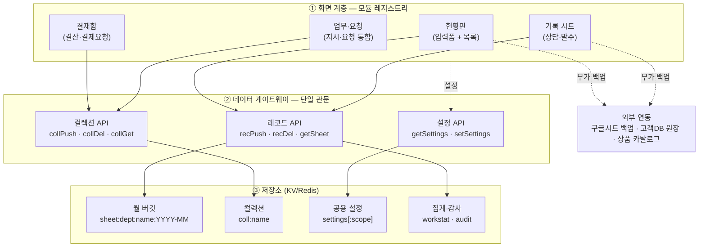
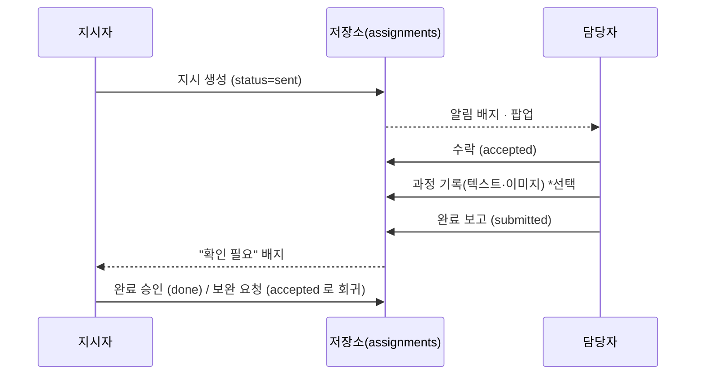
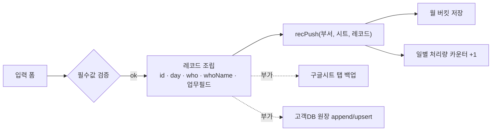
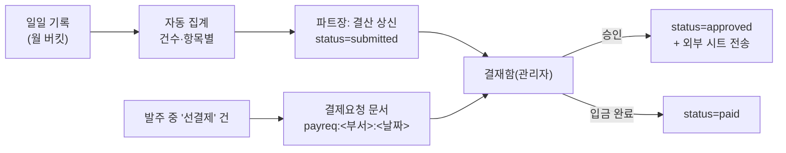

# 통합 업무관리 — 시스템 흐름 요약

> 목적: **업무 등록**과 **시트(기록) 관리**가 어떤 구조로 돌아가는지 정리한 문서.
> 다른 플랫폼(다른 언어·프레임워크·DB)으로 옮길 때 설계 그대로 가져갈 수 있도록,
> 구현 코드가 아니라 **계약(contract)과 흐름** 중심으로 적었습니다.
> 마지막 8장에 이식 체크리스트와 실패 사례(피해야 할 것)를 붙였습니다.
>
> 사내용 설명은 [`시스템-개요-및-데이터흐름.md`](시스템-개요-및-데이터흐름.md)(무엇을 하는 프로그램인가) ·
> [`ARCHITECTURE.md`](ARCHITECTURE.md)(파일 위치·코드 구조)를 보세요. 이 문서는 **밖으로 들고 나가는 용도**입니다.

---

## 1. 한 장 요약



**설계 원칙 3가지**

| 원칙 | 뜻 | 왜 |
|---|---|---|
| **단일 관문** | 모든 저장은 게이트웨이 하나를 통과 | 키 규칙·검증·집계를 한 곳에서 강제 |
| **저장 형태는 두 가지뿐** | ⓐ 월 버킷 레코드 ⓑ 컬렉션 | 새 기능이 생겨도 저장 패턴이 늘지 않음 |
| **외부 연동은 부가(best-effort)** | 구글시트·원장 전송 실패해도 본 저장은 성공 | 외부 장애가 업무를 막지 않음 |

---

## 2. 핵심 개념 5가지

### 2-1. 화면 = 모듈 레지스트리
```
MODULES['<부서>.<기능>'] = { title, icon, render(root, ctx) }
라우팅: #부서.기능?조건            메뉴: NAV 배열
```
- 화면 하나 추가 = **① 모듈 정의 ② 로드 등록 ③ 메뉴 등록** 세 곳.
- 라우터는 `?` 뒤를 **조건(필터)** 으로 잘라 모듈에 넘김 → *필터가 걸린 링크를 그대로 공유*할 수 있음.

### 2-2. 레코드 = 월 버킷 (실무 기록)
```
키:  sheet:<부서>:<시트명>:<YYYY-MM>     (해시)
필드: <레코드 id> → JSON
필수: id · day(YYYY-MM-DD) · who(작성 계정) · whoName
```
- **조회는 필요한 달만 읽음** → 데이터가 몇 년 쌓여도 조회량이 일정.
- 기간 조회 = 걸치는 달 목록을 만들어 **병렬 조회 후 합침**.
- 같은 id로 다시 쓰면 덮어씀(= 수정). 최초 생성일 때만 집계 카운터를 올림.

### 2-3. 컬렉션 = 공용 목록 (업무·요청·공지·로그)
```
키:  coll:<이름>   (해시)   ·   전체 읽기(HGETALL)
```
- 읽을 때 **전체를 가져옴** → 무한히 쌓이는 로그성 데이터엔 부적합(4-4·8장 참고).
- 업무·요청처럼 "건수가 수천 이하로 유지되는" 목록에만 사용.

### 2-4. 설정 = 로컬 ↔ 서버 양방향 동기화
```
브라우저 localStorage  ⇄  settings[:부서]
공유 대상 키 목록 + 공유 범위(전사/부서)를 코드가 명시
```
- 저장 즉시 **디바운스 후 서버 push**, 로그인 세션당 1회 **pull**.
- ⚠️ **공유 목록에 등록하지 않은 키는 그 사람 브라우저에만 남는다.** (8-2 사고 사례)

### 2-5. 권한 = 역할 + 키 단위 부여
```
role: admin(전체) · lead(파트장) · member
perms[]      = 열람 허용 화면 키
editPerms[]  = 수정 허용 화면 키
DEPT_OPEN_KEYS = 부서원이면 기본 열람되는 화면
```
- 화면 안에서 **열람 조건과 수정 조건을 분리**해 쓴다. (파트장은 보이되, 수정은 부여받아야 가능)

---

## 3. 흐름 A — 업무 등록 (지시 · 요청)

두 종류를 **끝까지 따로 저장**하고, **화면에서만 하나로 합쳐** 보여준다.

| 종류 | 뜻 | 저장 | 상태 |
|---|---|---|---|
| **업무 지시** | 사람 → 사람에게 일을 맡김 | `coll:assignments` | 요청 → 진행 → 완료보고 → 완료 |
| **요청** | 팀원 → 관리자/부서장에게 조치를 요청 | `coll:requests` | 접수 → 처리중 → 완료 / 반려 |



**요청의 라우팅 규칙** — 이식 시 그대로 쓸 만한 부분
```
담당자를 지정했으면 → 그 사람에게만
지정하지 않았으면   → 요청자 부서의 부서장 → (없으면) 관리자
관리자는 감독 목적으로 항상 전체 열람
```

**상태 통합(뷰 전용)** — 두 종류를 한 표에 그리기 위한 정규화
```
공통 상태 : 대기 · 진행 · 검토 · 완료 · 반려
지시   sent→대기  accepted→진행  submitted→검토  done→완료  feedback→반려
요청   sent→대기  doing→진행     ─           done→완료  rejected→반려

한 줄(row) = { 종류, 제목, 영역(부서), 담당, 요청자, 상태, 기한, 진행률, 원본 }
```
- 정규화는 **읽기 전용 어댑터**로 둔다 → 저장 형식을 건드리지 않아 회귀 위험이 낮음.
- 처리 버튼은 `종류`에 따라 각자의 원래 전이 함수를 호출.

**화면 구성(사용자 관점으로 나눔)**
```
담당 필터 = [나에게 온 것] · [내가 보낸 것] · [전체]
보기      = 시트(표) / 카드     정렬 = 기한·우선순위·최신     묶기 = 영역·상태·담당·기한
빠른 입력 = 제목 + Enter → "나에게 보낸 지시" 로 저장 (= 개인 할 일. 새 저장 형태 불필요)
빈 목록   = 왜 비었는지 + 다음 행동 버튼(전체 보기 / 조건 지우기)
```

**알림 배지** — 카운트 소스가 둘이면 **합산 지점을 하나로**
```
배지 = 요청(미처리 + 결과 미확인) + 지시(수락 대기)
→ 각 소스는 자기 몫만 갱신하고, 합산·표시는 한 함수가 담당 (중복 카운트 방지)
```

---

## 4. 흐름 B — 시트(기록) 관리

실무 기록(상담·발주·후불·검수 등)은 **전부 같은 파이프라인**을 탄다.
화면 종류만 둘이고, 저장·조회 계약은 동일하다.

| 엔진 | 쓰임 | 화면 형태 |
|---|---|---|
| **입력형 현황판** | 접수·등록이 잦은 업무 | 위: 입력 폼 / 아래: 목록·필터 |
| **기록 뷰** | 이미 쌓인 걸 조회·정정 | 기간 필터 + 표(인라인 수정) |

### 4-1. 등록 → 저장

- **id는 클라이언트가 생성**(uuid) → 재전송·수정이 멱등(같은 id면 덮어쓰기).
- 부가 연동은 실패해도 무시(fire-and-forget). 화면엔 "미전송" 배지로만 표시하고 재전송 버튼 제공.

### 4-2. 조회 → 표시
```
기간(from~to) → 걸치는 달 목록 → 달별 병렬 조회 → id 기준 병합 → 클라이언트에서 필터·정렬
표시 상한(예: 2000건)을 두고 "기간을 좁혀 보세요" 안내
```
- **필터·정렬·검색은 전부 클라이언트**에서 처리 → 서버 호출은 달 수만큼만.

### 4-3. 수정 · 삭제
```
수정: 기존 레코드 전체를 펼쳐 변경분만 덮어씀 → 같은 id로 recPush
      · 날짜가 다른 달로 바뀌면 (이전 달에서 삭제 + 새 달에 저장)
삭제: recDel(부서, 시트, id, 달, who, day) → 카운터 -1 + 감사 로그 기록
권한: 수정은 본인·파트장·부여받은 사람 / 삭제는 관리자·파트장
팀원: "수정 요청" 버튼 → 요청(3장)으로 전달 (직접 수정 대신 요청 경로)
```

### 4-4. 표시 보강(enrich) — 과거 데이터 채우기 패턴
> 나중에 추가된 필드는 예전 레코드에 없다. 마이그레이션 대신 **화면에서만 보강**한다.

```
화면에 뜬 레코드에서 조회 키(예: 상품코드)만 모음
→ 중복 제거 → 마스터에 한 번에 조회(다건 조회 1회)
→ 결과를 메모리 캐시에 저장 → 다시 그림
※ 이미 조회한 키는 재요청하지 않음. 실패해도 빈 값으로 고정해 무한 재시도 방지.
```
- 새 레코드는 등록 시점에 값을 함께 저장 → 시간이 지나면 보강 호출이 자연히 줄어듦.

### 4-5. 선택 항목(드롭다운) 관리
```
구분·경로·고객유형 같은 값 목록 = 공용 옵션 레지스트리(팀 공유 설정)
담당자 목록 = 저장된 목록 ∪ 해당 부서 계정(로스터)   ← 계정만 만들면 자동 노출
```
- ⚠️ 사람 목록을 **화면마다 하드코딩하면 반드시 사고 난다.** (8-2)

---

## 5. 흐름 C — 결산 · 결재 · 결제요청



**결제요청 화면 = 이체 단위로 블록화** (실무 흐름을 화면 구조에 맞춘 예)
```
■ 업체명 [건수]   계좌   [계좌 복사]              입금액 합계
    항목 1 … 금액
    항목 2 … 금액
```
- **한 블록 = 한 번의 이체.** 1건짜리 업체도 같은 형태로(예외 없음) → 어디까지가 한 건인지 헷갈릴 여지 제거.
- 계좌는 행마다 반복하지 않고 블록 머리줄에 한 번만 → 오독 위험 감소.
- 계좌가 비면 빨갛게 **확인 필요** 표시.

---

## 6. 저장 계약 (그대로 옮겨 쓸 수 있는 API 표)

### 쓰기 (POST)
| op | 인자 | 하는 일 |
|---|---|---|
| `recPush` | dept, sheet, record | 월 버킷에 저장(신규면 카운터 +1). `id`·`day` 필수, 시트 화이트리스트 검증 |
| `recDel` | dept, sheet, id, month, who, day | 삭제 + 카운터 -1 + 감사 로그 |
| `collPush` | coll, item | 컬렉션에 upsert(id 기준) |
| `collDel` | coll, id | 컬렉션에서 제거 |
| `setSettings` | scope, settings | 공용 설정 저장 |
| `workLog` | dept, event | 처리 이벤트 적재(집계용) |

### 읽기 (GET `?type=`)
| type | 인자 | 반환 |
|---|---|---|
| `sheet` | dept, sheet, month | 그 달의 레코드 배열 |
| `coll` | coll | 컬렉션 전체 |
| `settings` | scope | 공용 설정 |
| `workstat` / `worklog` | dept, month | 집계 / 원본 이벤트 |

### 검증 규칙 (서버에서 반드시)
```
시트명   : 부서별 화이트리스트에 있는 것만 허용
컬렉션명 : [a-z0-9_]{1,40}
day      : YYYY-MM-DD   ·   month: YYYY-MM
id       : 필수 · 비어 있으면 거부
```

### 백업
```
매일   전체 스냅샷 → backup:day:<YYYY-MM-DD>  (gzip · 14일 자동 만료)
매월 1일 월간 스냅샷 → backup:<YYYY-MM> + 컬렉션·설정 전체
※ 새 컬렉션을 만들면 스냅샷 대상 목록에 추가해야 함(누락되면 백업에서 빠짐)
```

---

## 7. 다른 플랫폼으로 옮길 때 대응표

| 이 시스템 (KV) | 관계형 DB로 옮기면 | 문서 DB로 옮기면 |
|---|---|---|
| 월 버킷 `sheet:부서:시트:YYYY-MM` | `records` 테이블 + `(dept, sheet, day)` 인덱스<br/>*월 버킷은 인덱스가 없는 KV의 대체물이므로, 인덱스가 있으면 굳이 쪼갤 필요 없음* | 컬렉션 1개 + 복합 인덱스 |
| 컬렉션 `coll:이름` | 종류별 테이블(`assignments`, `requests` …) | 컬렉션별 문서 |
| 컬렉션 전체 읽기 | **하지 말 것** — 조건 조회로 대체 | 쿼리 + 페이지네이션 |
| 설정 localStorage ↔ 서버 | `settings(scope, key, value)` 테이블 + 사용자별 캐시 | 동일 |
| 처리량 카운터 `HINCRBY` | 집계 쿼리 또는 요약 테이블 | 집계 파이프라인 |
| 클라이언트 필터·정렬 | 데이터가 커지면 **서버 쿼리로 이동** | 동일 |

**옮길 때 그대로 가져갈 것 (설계 자산)**
1. 저장 형태를 두 가지로 제한하는 규율
2. 게이트웨이 단일화 + 서버측 화이트리스트 검증
3. `id`는 클라이언트 생성 → 멱등 저장(재전송·수정 안전)
4. 외부 연동은 부가 처리, 실패해도 본 저장 성공
5. 상태 정규화를 **읽기 전용 어댑터**로 두기
6. 조건을 URL에 실어 화면 링크 공유
7. 열람 권한과 수정 권한 분리
8. 사람·선택 목록은 계정에서 파생, 하드코딩 금지

---

## 8. 실제로 났던 사고 (같은 실수 반복 방지)

### 8-1. 기본값이 사용자 데이터를 덮어씀
```
잘못: 저장된 값이 비어 있으면 → 기본값을 만들어 서버에 저장
결과: 한 사람 화면에서 초기화가 발생하자 그 값이 팀 전체로 동기화 → 템플릿 유실(복구 불가)
교훈: 기본값은 메모리에서만 쓰고 절대 저장하지 않는다. 저장은 항상 사용자 조작으로만.
대책: ① 서버 값 먼저 읽고 그리기 ② 명시적 [저장] ③ 일 단위 복구 지점 ④ 로컬 내보내기
```

### 8-2. 공유 대상에 등록하지 않은 설정
```
증상: 관리자가 담당자 이름을 추가했는데 다른 팀원 화면엔 안 보임(권한을 줘도 동일)
원인: 그 목록 키가 '공유 설정 목록'에 없어 추가한 사람 브라우저에만 저장됨
교훈: 사람·조직 정보는 설정이 아니라 계정(로스터)에서 파생시킨다.
      설정으로 둘 수밖에 없다면 키를 반드시 공유 목록 + 공유 범위에 함께 등록.
```

### 8-3. 배지가 두 곳에서 따로 세어짐
```
같은 건이 두 메뉴에 각각 배지로 떠서 실제보다 많아 보임
→ 소스별로 자기 숫자만 갱신하고, 합산·표시는 한 곳에서만 하도록 통일
```

### 8-4. 목록이 비었을 때 "고장난 줄" 안다
```
비었으면 이유와 다음 행동을 함께 보여준다:
 배정 없음 → [전체 보기]   데이터 없음 → [첫 건 만들기]   조건 불일치 → 걸린 조건 나열 + [조건 지우기]
```

### 8-5. 화면 구조가 실제 작업 단위와 다르면 계속 헷갈린다
```
색·구분선으로 아무리 손봐도 해결되지 않던 문제가,
표를 '이체 단위(업체 = 한 번의 송금)' 로 다시 짜니 사라짐.
→ 표의 행 묶음 단위 = 사용자가 실제로 수행하는 작업 단위로 맞출 것.
```

---

## 9. 최소 구현 순서 (새 플랫폼에서 다시 만든다면)

```
1) 저장 게이트웨이 + 검증 (recPush/recDel/collPush/collDel/설정)
2) 계정·역할·권한(열람/수정 분리) + 계정 로스터 조회
3) 기록 시트 엔진 1개 (등록 → 조회 → 수정 → 삭제 → 기간 필터)
4) 업무 지시 · 요청 (상태 전이 + 라우팅 + 배지)
5) 통합 목록 화면 (정규화 어댑터 + 필터·정렬·묶기 + URL 조건)
6) 결산·결재 (집계 → 상신 → 승인)
7) 백업 스냅샷(일/월) + 활동 로그
8) 외부 연동(스프레드시트·원장) — 마지막. 없어도 시스템은 완결되어야 함.
```
